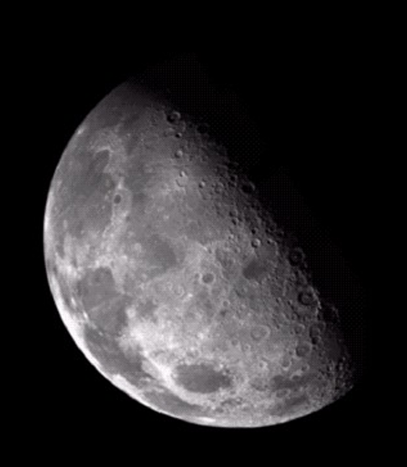
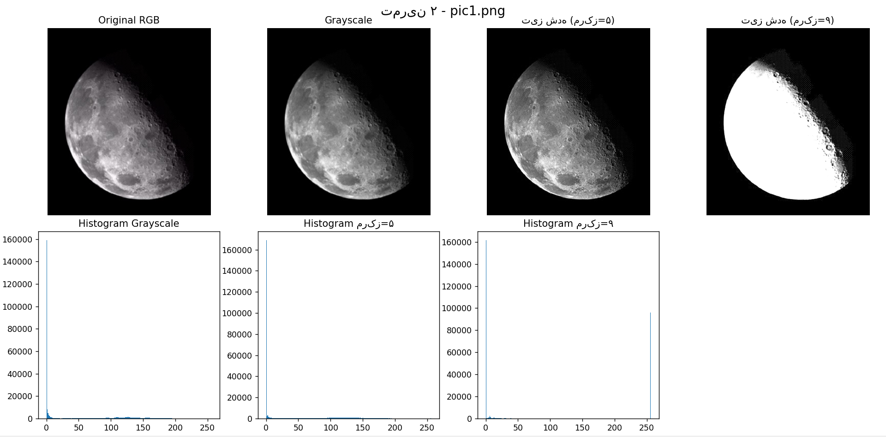
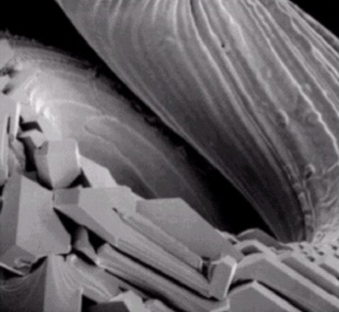
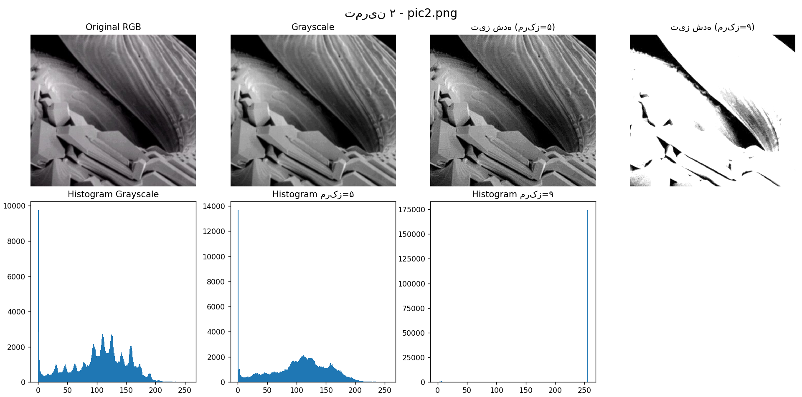

# Image Processing Homework 2 - Image Sharpening

## Description
This report covers image sharpening techniques using Python, OpenCV, and Matplotlib. I applied spatial filtering with different kernels to enhance edge details in the images.

## Objectives
- Convert RGB image to Grayscale
- Apply sharpening filter using convolution
- Compare sharpening with center weight 5 vs center weight 9
- Analyze the effect on image quality and noise

## Results - Exercise A & B
A

B

## Exercise C: Center Weight Comparison

- **Center Weight = 5**: Balanced sharpening with moderate edge enhancement.
- **Center Weight = 9**: Stronger sharpening. Edges are much sharper, but noise and artifacts increase.

**Observation**: Increasing the center weight to 9 makes the image appear sharper and more detailed, but it can also amplify unwanted noise. For most cases, a center weight between 5 and 8 provides better visual quality.

## Conclusion
Sharpening filters effectively enhance high-frequency components (edges). However, there is a trade-off between sharpness and noise. The choice of kernel weight depends on the image content and desired outcome.
